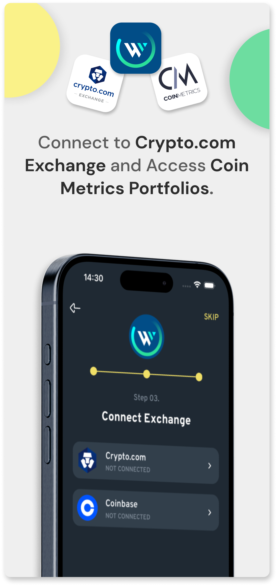

# 🚀 WealthAgile Application

## Smart Crypto Made Easy

Welcome to **WealthAgile**! Simplify your crypto journey with our platform, where 'Smart Crypto Made Easy' is more than just a motto. Manage your crypto assets 24/7 with ease, leveraging our auto-rebalancing of professional index portfolios designed to deliver consistent returns.

## 💼 What is WealthAgile?

New to crypto trading? No problem! Our **Index Portfolios** make managing your crypto account effortless. Experience world-class crypto portfolio management at your fingertips, ensuring that your crypto remains securely stored on your trusted exchange.

## 🛠️ Technologies Used

- ⚛️ **React Native** with TypeScript
- 💻 **Next.js** (Web version coming soon)
- ☁️ **AWS Lambda** for serverless API
- 🎨 **Figma** design to end-user UI conversion
- 🎨 **Tailwind CSS**
- 🟢 **Node.js**
- 🗄️ **MongoDB**

## 🌐 Connected Exchanges

WealthAgile is currently connected to:
- **Crypto.com**
- **Coinbase**

## 📥 Download WealthAgile

WealthAgile is live on both the App Store and Google Play Store. Download it now and experience managing your crypto with ease!

  
  

## 📸 Screenshots

Explore the WealthAgile app with these preview images:

  
  
  
  
  
  

---
